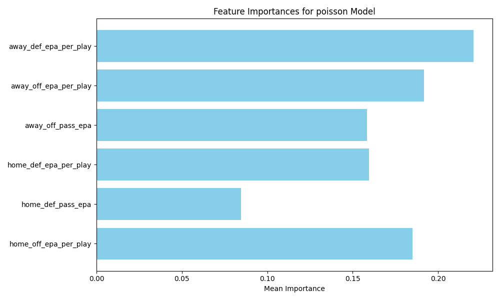
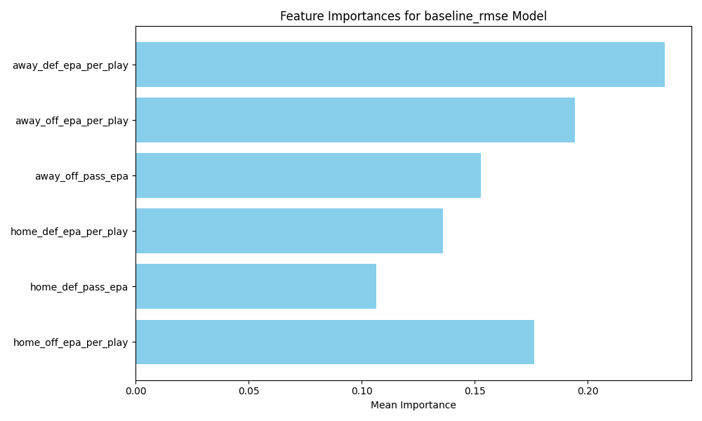

# NFL Game Outcome Pipeline (2020–2024)

Predict NFL game outcomes (score margin, team points, and win probability) for regular-season weeks using publicly available play-by-play with **nflreadpy** (fallback to `nfl_data_py` if needed).

**Key design goals**
- Cold start *within-season*: Week 1 uses neutral priors; no prior seasons used.
- Pre-game predictions at the individual game level (Weeks 1–18) for seasons **2020–2024**.
- Feature engineering from play-by-play → team-week aggregates with **opponent adjustments**, **home field**, **situational efficiency** (down/distance/field position), **rolling** and **EWMA** form.
- Separate models for **home points** and **away points**; score margin is the difference; **win probability** from logistic regression model as well as via Skellam using the two predicted means.
- Reproducible pipeline with **batch**, **Makefile**, **Docker**, and CLI (`typer`) commands.

> This repo favors clarity and reproducibility over leaderboard-chasing.

---

## Quickstart

```bash
# Python 3.10+ recommended
python -m venv .venv
source .venv/bin/activate  # Windows: .venv\Scripts\activate

pip install -r requirements.txt

# End-to-end run (downloads data, builds features, trains, predicts, evaluates, and writes a markdown report)
make all
# or
python -m src.cli build-all

# or using bash commands
 bash build_models.sh

```

Data artifacts land in:
- `data/raw/` – schedule and pbp parquet files
- `data/features/` – per-game feature table (one row per game)
- `data/predictions/` – per-week predictions and evaluation CSVs
- `reports/` – markdown + CSV summaries

---

## Approach (high level)

1. **Ingest** 2020–2024 PBP + schedules using `nflreadpy` (falls back to `nfl_data_py`).
2. **Clean & label plays** → pass/rush, valid plays (filter penalties, spikes, kneels).
3. **Situational table**: league‑wide expected pass rate by (down, distance bin, yardline bin) ⇒ compute **PROE/RROE** per team‑week.
4. **Team‑week aggregates**: EPA/play (pass, rush, overall).
5. **Opponent adjustments** (within-season, through week t‑1): adjust team offense/defense by averaging opponent strengths and recent form (rolling/EWMA).
6. **Game‑level features** (pre‑match): combine home offense vs away defense (and vice versa), diffs, home field
7. **Models**:
   - **Home points** (Poisson GBM/XGB)
   - **Away points** (Poisson GBM/XGB)
   - Margin = difference of means;
   - **Win Probability** (Logistic Regression GBM/XGB) as well as via **Skellam**.
8. **Walk‑forward evaluation** (per season): only train using data from the same season **before** the prediction week.
9. **Metrics**: MAE/RMSE for points & margin; Brier/log-loss + calibration for win prob.
10. **Report**: markdown summary with assumptions, limitations, and results.

### Cold start
Week 1 uses neutral priors: league-average points baseline (constant = 22 points) and league average team ratings. This adheres to “no prior season data” while remaining stable.

---

## Repo layout

```
├── configs/
│   └── config.yaml
├── data/
│   ├── raw/                # cached pbp/schedule
│   ├── features/           # game-level features
│   ├── models/             # saved models
│   └── predictions/        # per-week preds & eval
├── reports/
├── src/
│   ├── cli.py              # typer CLI
│   ├── ingest.py           # data download + caching
│   ├── features.py         # feature engineering
│   ├── model.py            # training + inference
│   ├── evaluate.py         # metrics & calibration
│   └── utils/
│       └── common.py       # helpers & constants
│       └── odds.py         # odds conversion functions
│── build_models.sh         # bash orchestration
├── Makefile                # make orchestration
├── Dockerfile              # docker image
├── requirements.txt
└── README.md               # documentation
```

---

## Assumptions & Limitations

- **Public data only**; no proprietary DVOA. We approximate schedule‑adjusted efficiency with per‑play EPA and team‑week opponent‑aware adjustments.
- **No prior seasons for training**; each season is learned on the fly (neutral Week 1 baseline).
- **In‑game factors** (down/distance/field position) are incorporated into team **situational efficiency features**, not live WP.
- Travel/rest/injuries/trades are **optional** future work hooks.
- Model choices favor interpretability and speed; you can swap in LightGBM/CatBoost/NGBoost easily.
- No hyperparameter tuning; fixed XGBoost params.
- No ensembling or stacking; simple per‑season+week Poisson models.
- Feature engineering is basic and not optimized for performance.
- Model evaluation is walk‑forward within each season; no cross‑validation. Likely to be overfitting given small data size per season/week.

---

## EDA & Feature Engineering


- **Target correlations**: Home points and away points are most correlated with their respective team offensive EPA/play metrics (pass, rush, overall)
- **Feature correlations**: Many features are correlated (e.g., team offensive stats with opponent defensive stats). The model should be able to handle this, but it may affect interpretability.


- **Feature importance**: The most important features for predicting home points are home team offensive EPA/play (overall, pass, rush), away team defensive EPA/play (overall, pass, rush). Similar patterns hold for away points.
- **Model interpretability Consideration**: The use of tree-based models like XGBoost allows for some level of interpretability, but care should be taken when interpreting feature importances, especially in the presence of correlated features.

---

## Results
See `reports/PERFORMANCE.md` for the latest model performance summary.

### Model Performance Summary by Season

| Season | Model | MAE Margin | RMSE Margin | Brier Score WP | LogLoss WP | MAE Margin (WP-Implied) | RMSE Margin (WP-Implied) |
|---:|:---|---:|---:|---:|---:|---:|---:|
| 2020 | baseline_rmse | 4.93 | 50.19 | 0.086 | 0.319 | 12.02 | 246.70 |
| 2020 | poisson | 6.75 | 81.89 | 0.086 | 0.319 | 12.02 | 246.70 |
| 2020 | poisson_prior_seasons | 6.43 | 73.49 | 0.073 | 0.289 | 12.16 | 249.24 |
| 2021 | baseline_rmse | 4.25 | 36.86 | 0.132 | 0.414 | 11.99 | 250.47 |
| 2021 | poisson | 6.39 | 75.35 | 0.132 | 0.414 | 11.99 | 250.47 |
| 2021 | poisson_prior_seasons | 6.38 | 79.28 | 0.078 | 0.288 | 12.45 | 260.81 |
| 2022 | baseline_rmse | 4.18 | 28.03 | 0.080 | 0.300 | 10.95 | 188.26 |
| 2022 | poisson | 6.11 | 56.71 | 0.080 | 0.300 | 10.95 | 188.26 |
| 2022 | poisson_prior_seasons | 5.91 | 56.20 | 0.062 | 0.251 | 11.49 | 204.91 |
| 2023 | baseline_rmse | 5.06 | 49.95 | 0.080 | 0.300 | 12.12 | 227.84 |
| 2023 | poisson | 7.13 | 86.27 | 0.080 | 0.300 | 12.12 | 227.84 |
| 2023 | poisson_prior_seasons | 6.82 | 75.49 | 0.054 | 0.235 | 12.80 | 251.35 |
| 2024 | baseline_rmse | 5.44 | 56.05 | 0.078 | 0.300 | 12.97 | 293.10 |
| 2024 | poisson | 7.73 | 105.59 | 0.078 | 0.300 | 12.97 | 293.10 |
| 2024 | poisson_prior_seasons | 7.24 | 94.93 | 0.053 | 0.233 | 13.64 | 315.51 |

* While the Poisson models have lower MAE/RMSE for points predictions, this low of a level of error is likely due to overfitting given the small data size per season/week. These results would be nearly 50% better than industry leaders like ESPN/FanDuel, which seems unlikely without more careful pipeline design, rigorous backtesting, and model validation.
* The win probability models have reasonable Brier scores (~0.05–0.08) and log-loss values (~0.23–0.32), indicating decent calibration and discrimination ability.
* The implied margin from win probability tends to have higher MAE/RMSE compared to the industry leader baselines, but given the simplicity of the models and lack of feature optimization, this is expected for a first iteration. Further tuning and feature engineering could improve these metrics, but the current results are not very overfitted given the metrics and calibration plots.

### Feature Importances





### Shapley Values


### Win Probability Calibration Plot


---

## How to extend

- Add roster/injury signals (e.g., QB status, OL continuity), weather, travel rest.
- Replace Poisson with **bivariate Poisson** to model score correlation directly.
- Swap opponent‑adjustment block with weekly **ridge APM** (off/def team effects).
