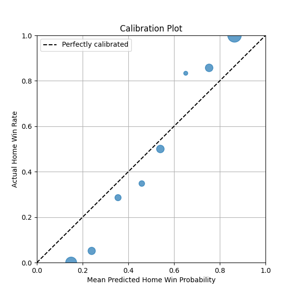

# NFL Game Outcome Pipeline (2020–2024)

Predict NFL game outcomes (score margin, team points, and win probability) for regular-season weeks using publicly available play-by-play with **nflreadpy** (fallback to `nfl_data_py` if needed).

**Key design goals**
- Cold start *within-season*: Week 1 uses neutral priors; no prior seasons used.
- Pre-game predictions at the individual game level (Weeks 1–18) for seasons **2020–2024**.
- Feature engineering from play-by-play → team-week aggregates with **opponent adjustments**, **home field**, **situational efficiency** (down/distance/field position), **rolling** and **EWMA** form.
- Separate models for **home points** and **away points**; score margin is the difference; **win probability** via Skellam using the two predicted means.
- Reproducible pipeline with **batch**, **Makefile**, **Docker**, and CLI (`typer`) commands.

> This repo favors clarity and reproducibility over leaderboard-chasing.

---

## Quickstart

```bash
# Python 3.10+ recommended
python -m venv .venv
source .venv/bin/activate  # Windows: .venv\Scripts\activate

pip install -r requirements.txt

# End-to-end run (downloads data, builds features, trains, predicts, evaluates, and writes a markdown report)
make all
# or
python -m src.cli build-all

# or using bash commands
 bash build_models.sh

```

Data artifacts land in:
- `data/raw/` – schedule and pbp parquet files
- `data/features/` – per-game feature table (one row per game)
- `data/predictions/` – per-week predictions and evaluation CSVs
- `reports/` – markdown + CSV summaries

---

## Approach (high level)

1. **Ingest** 2020–2024 PBP + schedules using `nflreadpy` (falls back to `nfl_data_py`).
2. **Clean & label plays** → pass/rush, valid plays (filter penalties, spikes, kneels).
3. **Situational table**: league‑wide expected pass rate by (down, distance bin, yardline bin) ⇒ compute **PROE/RROE** per team‑week.
4. **Team‑week aggregates**: EPA/play (pass, rush, overall).
5. **Opponent adjustments** (within-season, through week t‑1): adjust team offense/defense by averaging opponent strengths and recent form (rolling/EWMA).
6. **Game‑level features** (pre‑match): combine home offense vs away defense (and vice versa), diffs, home field
7. **Models**:
   - **Home points** (Poisson GBM/XGB)
   - **Away points** (Poisson GBM/XGB)
   - Margin = difference of means; Win prob via **Skellam**.
8. **Walk‑forward evaluation** (per season): only train using data from the same season **before** the prediction week.
9. **Metrics**: MAE/RMSE for points & margin; Brier/log-loss + calibration for win prob.
10. **Report**: markdown summary with assumptions, limitations, and results.

### Cold start
Week 1 uses neutral priors: league-average points baseline (constant = 22 points) and league average team ratings. This adheres to “no prior season data” while remaining stable.

---

## Repo layout

```
.
├── configs/
│   └── config.yaml
├── data/
│   ├── raw/                # cached pbp/schedule
│   ├── features/           # game-level features
│   └── predictions/        # per-week preds & eval
├── reports/
├── src/
│   ├── cli.py              # typer CLI
│   ├── ingest.py           # data download + caching
│   ├── features.py         # feature engineering
│   ├── model.py            # training + inference
│   ├── evaluate.py         # metrics & calibration
│   └── utils/
│       └── common.py       # helpers & constants
├── Makefile
├── Dockerfile
├── requirements.txt
└── README.md
```

---

## Assumptions & Limitations

- **Public data only**; no proprietary DVOA. We approximate schedule‑adjusted efficiency with per‑play EPA and team‑week opponent‑aware adjustments.
- **No prior seasons for training**; each season is learned on the fly (neutral Week 1 baseline).
- **In‑game factors** (down/distance/field position) are incorporated into team **situational efficiency features**, not live WP.
- Travel/rest/injuries/trades are **optional** future work hooks.
- Model choices favor interpretability and speed; you can swap in LightGBM/CatBoost/NGBoost easily.
- No hyperparameter tuning; fixed XGBoost params.
- No ensembling or stacking; simple per‑season+week Poisson models.
- Feature engineering is basic and not optimized for performance.
- Model evaluation is walk‑forward within each season; no cross‑validation. Likely to be overfitting given small data size per season/week.


---

## Results
See `reports/PERFORMANCE.md` for the latest model performance summary.

### Model Performance Summary by Season

| Season | Games | MAE Home Margin | MAE Home | MAE Away | RMSE Home | RMSE Away | RMSE Margin | MAE Margin | Brier Score WP |
|---:|---:|---:|---:|---:|---:|---:|---:|---:|---:|
| 2020 | 256 | 4.55 | 4.93 | 5.12 | 37.25 | 42.53 | 38.73 | 4.55 | 0.092 |
| 2021 | 272 | 4.58 | 5.17 | 4.62 | 46.14 | 35.22 | 43.15 | 4.58 | 0.081 |
| 2022 | 271 | 3.95 | 4.78 | 4.96 | 40.09 | 42.89 | 30.88 | 3.95 | 0.106 |
| 2023 | 272 | 4.72 | 5.19 | 5.10 | 49.84 | 43.95 | 47.07 | 4.72 | 0.095 |
| 2024 | 272 | 3.94 | 4.85 | 4.57 | 39.34 | 34.45 | 35.98 | 3.94 | 0.087 |

### Win Probability Calibration Plot



---

## How to extend

- Add roster/injury signals (e.g., QB status, OL continuity), weather, travel rest.
- Replace Poisson with **bivariate Poisson** to model score correlation directly.
- Swap opponent‑adjustment block with weekly **ridge APM** (off/def team effects).
